# Testing and Validation

This document describes the tests performed to validate the high-availability, load balancing and auto-scaling behavior of the AWS infrastructure.

The tests were performed progressively as the infrastructure evolved throughout the practical exercises.

---

## 1. Application Load Balancer Connectivity

### Objective

Validate that the web application can be accessed through the Application Load Balancer instead of directly accessing the EC2 instances.

### Procedure

1. Access the Application Load Balancer.
2. Copy the DNS name assigned to the Load Balancer.
3. Open the DNS endpoint using HTTP.
4. Verify that the web application is displayed.

### Expected Result

The application should be accessible through the ALB DNS endpoint.

### Result

The application was successfully accessed through the Application Load Balancer.

### Evidence
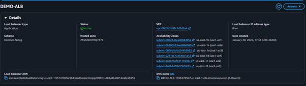

---

## 2. Target Group Health Check

### Objective

Validate that the Target Group detects the health status of the EC2 instances.

### Procedure

1. Verify that both EC2 instances are registered in the Target Group.
2. Stop one of the EC2 instances.
3. Monitor the Target Group health status.
4. Verify that the stopped instance is detected as unhealthy.

### Expected Result

The Target Group should detect the stopped instance and mark it as unhealthy.

### Result

The Target Group detected the instance failure.

### Evidence
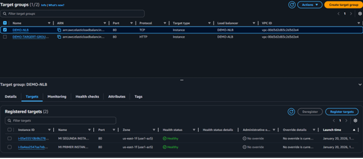

---

## 3. Load Balancer Failure Handling

### Objective

Validate that the Application Load Balancer stops sending traffic to an unavailable instance.

### Procedure

1. Stop one of the EC2 instances.
2. Wait for the Target Group health check to detect the failure.
3. Access the application through the ALB DNS endpoint.
4. Verify that the application remains available through the healthy instance.

### Expected Result

Traffic should continue to be handled by the available healthy instance.

### Result

The test demonstrated the Load Balancer's ability to detect an unavailable target and continue serving the application through the available infrastructure.

### Evidence

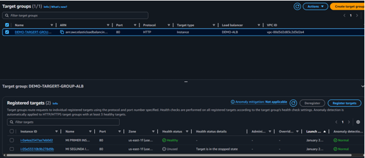

---

## 4. Auto Scaling Instance Replacement

### Objective

Validate that the Auto Scaling Group maintains the configured minimum number of instances.

### Procedure

1. Verify the desired and minimum capacity configured in the Auto Scaling Group.
2. Remove an EC2 instance managed by the Auto Scaling Group.
3. Monitor the Auto Scaling activity.
4. Verify that a new EC2 instance is launched.

### Expected Result

The Auto Scaling Group should automatically launch a replacement instance when the number of instances falls below the configured capacity.

### Result

A replacement EC2 instance was automatically launched by the Auto Scaling Group.

### Evidence
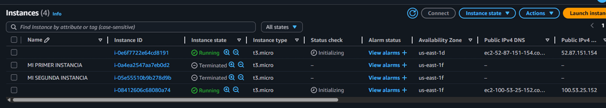

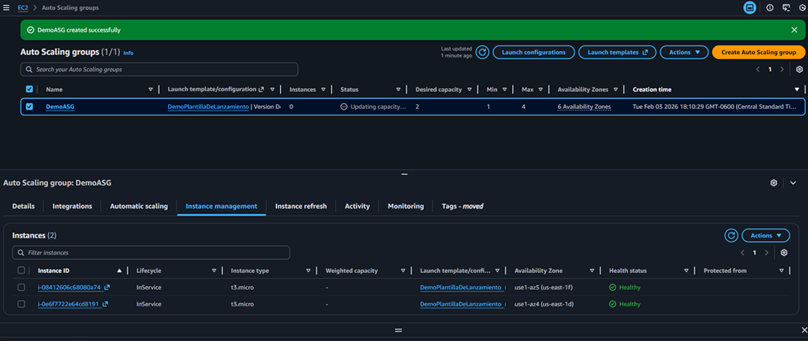

---

## 5. Dynamic Scaling Test

### Objective

Validate the dynamic scaling policy using CPU utilization.

### Procedure

CPU load was generated on an EC2 instance using the `stress` utility.

sudo amazon-linux-extras install epel -y
sudo yum install stress -y
stress -C 4
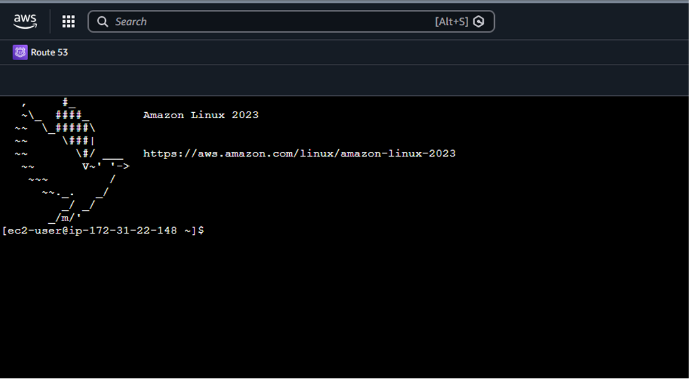

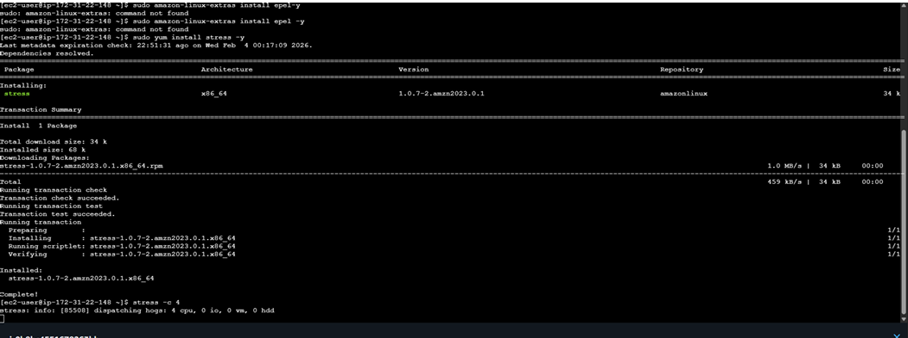

---

## Expected Result

The increased CPU utilization should trigger the configured scaling behavior according to the Auto Scaling policy. 

Result

The CPU utilization increased and the resulting activity was monitored through CloudWatch.
### Evidence

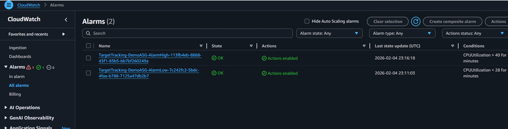

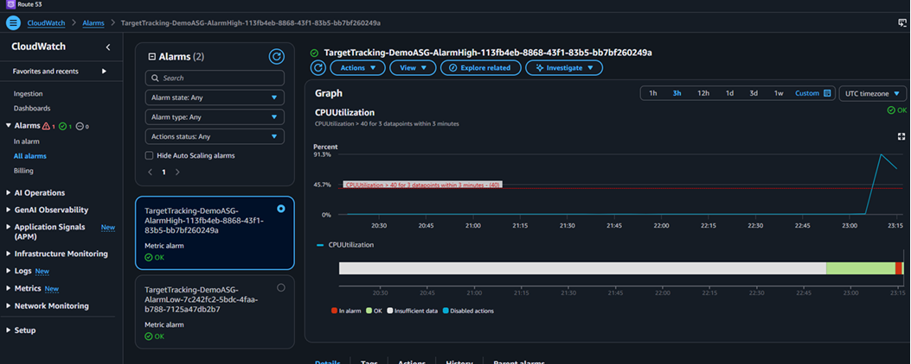

---
## 6. Sticky Sessions Test
Objective

Validate session persistence between the client and the backend EC2 instance.

Procedure
Enable Sticky Sessions in the Target Group attributes.
Access the application through the Load Balancer.
Refresh the application page.
Observe the backend instance receiving the request.
### Evidence

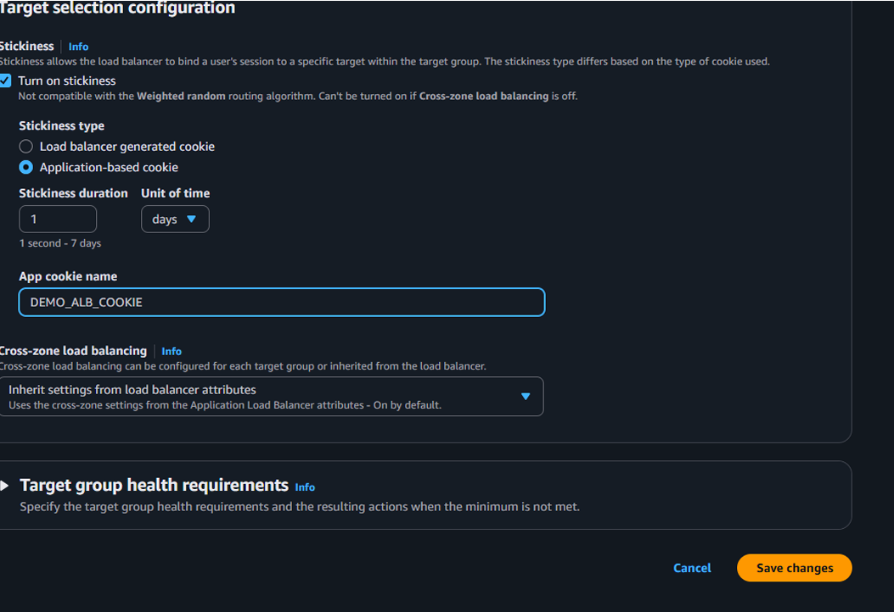
Expected Result

The client should continue to be directed to the same backend instance while the sticky session is active.

Result

The client remained associated with the same instance after refreshing the application.
### Evidence

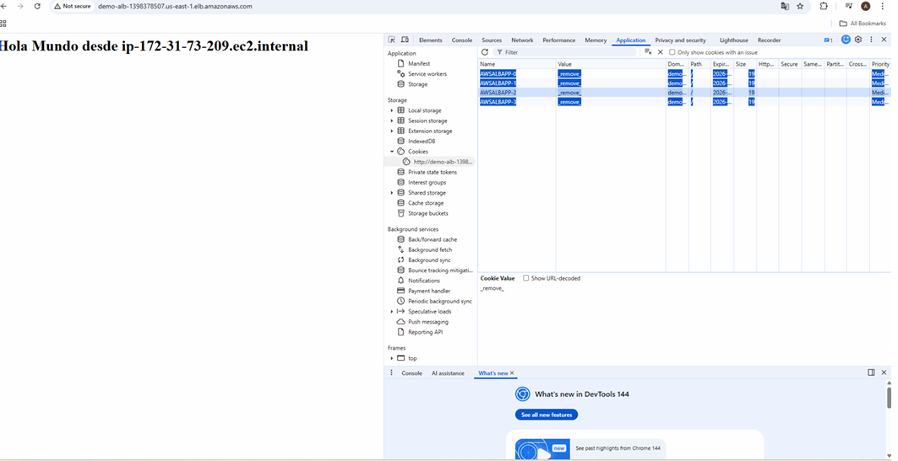

---

## Test Summary

Test	                          Expected Result	                              Status
ALB connectivity	              Application accessible through ALB DNS	      Passed
Target Group health check      	Failed instance detected	                    Passed
Load Balancer failure handling	Traffic continues through healthy target	    Passed
Auto Scaling replacement      	Replacement instance launched	                Passed
Dynamic scaling                	Scaling policy responds to CPU utilization	  Passed
Sticky Sessions	                Client remains associated with same instance	Passed

---

## Conclusion

The tests validated the main high-availability and scalability mechanisms implemented during the practical exercises.

The infrastructure was able to:

Provide application access through an Application Load Balancer.
Detect unhealthy EC2 instances through Target Group health checks.
Continue serving traffic through available instances.
Automatically replace instances through the Auto Scaling Group.
Monitor CPU utilization through Amazon CloudWatch.
Apply session persistence using Sticky Sessions.
